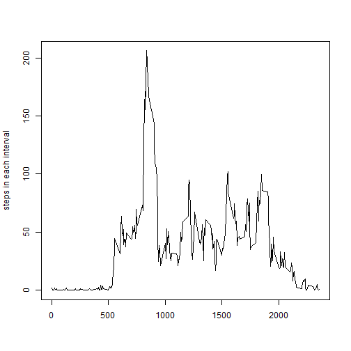
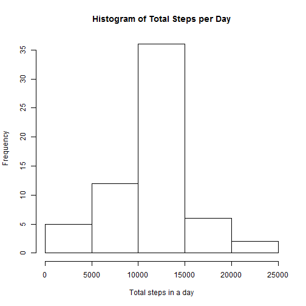
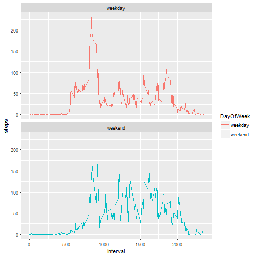

# Reprodiciable Research Week 2 Project"


## Project Introduction:

In this project, we will explore activity data from a personal activity monitoring device which collected data (of an anonymous individual) at 5 minute intervals through out the day during the months of October and November, 2012. The original data set can be accessed at  <https://d396qusza40orc.cloudfront.net/repdata%2Fdata%2Factivity.zip>.

For this exercise the original data set is already downloaded to the local folder.The following loads the data into a data frame in R:


```r
dfAct <- read.csv("activity.csv")
```

## Calculate the total number of steps taken per day:
First finding total number of steps for each and then creating a new data frame for later use


```r
dailyTotals <- with(dfAct, tapply(steps, date, sum))
dfByDay <- as.data.frame(dailyTotals)
dfByDay$date <- rownames(dfByDay)
```

## Histogram of the total number of steps taken each day:
In this we use hist() from base plot with default range of "daily steps"


```r
hist(dfByDay$dailyTotals, main="Histogram of Total Steps per Day", 
     xlab="Total steps in a day")
```


Below we find the mean and median of the total number of steps taken per day

```r
 summary(dfByDay$dailyTotals)
```

```
##    Min. 1st Qu.  Median    Mean 3rd Qu.    Max.    NA's 
##      41    8841   10760   10770   13290   21190       8
```

## Time series plot of the 5-minute interval and the average number of steps taken, averaged across all days
To do this we will first compute averages for each interval for all observed dates, omitting NA values. Then we create a data frame with average steps and interval of the day as two columns.


```r
AvgByInterval <- with(na.omit(dfAct), tapply(steps, as.factor(interval), mean))
dfByInterval <- as.data.frame(AvgByInterval)
dfByInterval$interval <- rownames(dfByInterval)
```

From the above data frame we can plot a time series between the interval and average steps


```r
with(dfByInterval, {
	plot(interval, AvgByInterval, type="l", main="", ylab="steps in each interval", xlab = "")
})
```



We can also find from this data Which 5-minute interval, on average across all the days in the data set, contains the maximum number of steps.


```r
dfByInterval[which(dfByInterval$AvgByInterval == max(dfByInterval$AvgByInterval)), ]
```

```
##     AvgByInterval interval
## 835      206.1698      835
```

Now let's find how many number of missing values are in the data set


```r
sum(is.na(dfAct))
```

```
## [1] 2304
```

Since there are **2304** records with NA, let's impute the data with some estimated values. To be more realistic, we could use a random number between 25th and 75th percentile of each "interval period" over observed days. But, to be simple for this exercise let's chose to replace NA cell values with the averages of corresponding interval over all days. We can create a new imputed data frame by assigning missing values from  **AvgByInterval** as shown below:


```r
dfAct_imputed <- dfAct
for (i in 1:nrow(dfAct_imputed)) {
  if (is.na(dfAct_imputed$steps[i])) {
	dfAct_imputed$steps[i] <- AvgByInterval[rowname = as.character(dfAct_imputed$interval[i])]
  }
}
```

## Histogram of the total number of steps taken each day **from imputed data**
To repeat this histogram, let's recreate a new data frame with day totals from all intervals, as we did before.


```r
dailyTotals_imputed <- with(dfAct_imputed, tapply(steps, date, sum))
dfByDay_imputed <- as.data.frame(dailyTotals_imputed)
dfByDay_imputed$date <- rownames(dfByDay_imputed)
```

Now let's plot the histogram of above **dailyTotals_imputed** from above data frame.


```r
hist(dfByDay_imputed$dailyTotals_imputed, main="Histogram of Total Steps per Day", 
     xlab="Total steps in a day")
```



Let's investigate the mean and median of total number of steps taken per day **for imputed data**.


```r
mean(dfByDay_imputed$dailyTotals_imputed)
```

```
## [1] 10766.19
```

```r
median(dfByDay_imputed$dailyTotals_imputed)
```

```
## [1] 10766.19
```

Let;s compare that with the mean and medians **for original data with NAs**. 


```r
mean(dfByDay$dailyTotals, na.rm=TRUE)
```

```
## [1] 10766.19
```

```r
median(dfByDay$dailyTotals, na.rm=TRUE)
```

```
## [1] 10765
```

You can see that mean values between the two data frames remained same as we replaced the NA values with the interval means. Median slightly increased from original to imputed. 


## Differences in activity patterns between weekdays and weekends

Using the **weekdays()** function let's create a new variable **DaofOfWeek** for our imputed data frame. This variable will have two levels: "weekday" and "weekend".


```r
dfAct_imputed$DayOfWeek <- weekdays(as.Date(dfAct_imputed$date))
dfAct_imputed$DayOfWeek <- ifelse(dfAct_imputed$DayOfWeek %in% c("Saturday", "Sunday"), "weekend", "weekday")
dfAct_imputed$DayOfWeek <- as.factor(dfAct_imputed$DayOfWeek)
```

Let's create an aggregated daily totals separated weekday and weekend factor. We use **dplyr** package for this.


```r
library(dplyr)
```

```
## 
## Attaching package: 'dplyr'
```

```
## The following objects are masked from 'package:stats':
## 
##     filter, lag
```

```
## The following objects are masked from 'package:base':
## 
##     intersect, setdiff, setequal, union
```

```r
AvgByImputed_imp <- aggregate(steps ~ interval + DayOfWeek, dfAct_imputed, mean)
```

Now, let's plot time series of the 5-minute interval and the average number of steps taken, averaged across all weekday days or weekend days (using ggplot2):


```r
library(ggplot2)
ggplot(AvgByImputed_imp,aes(x=interval,y=steps,colour=DayOfWeek)) + geom_line() + facet_wrap( ~ DayOfWeek, nrow = 2)
```



Notice that there is some difference between average steps for each interval on weekdays and weekends. On weekends this individual has moved more during the day than on weekdays. However, on the weekdays this person made more steps during early hours of the day, comparing to weekends.

## ======== End of the Project ============  
